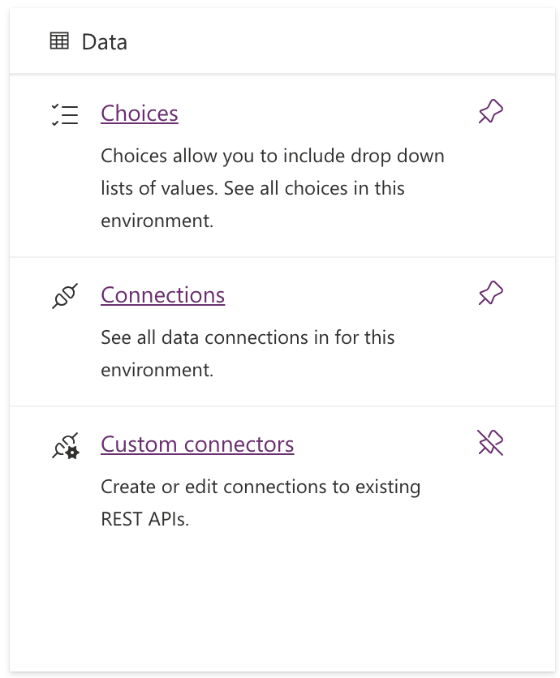

# Scan for Translations

This describes setting up a custom connector that knows how to scan a string for instances of calls to the translation function `__` that is an output of the Translation Component described in this repo.  It exists as a custom component because doing complex regular expression matching is much ( much ) faster and simpler in C# code than in a Power Automate Flow.

To create a custom connector, you must first get to the `Custom Connectors` screen in Power Apps.  If it's not already in your left-hand sidebar, click on the three dots `More` menu item at the bottom, then click the `Discover all` button at the bottom of the flyout.  Scroll down a little and find the `Data` section.  Therein you'll see `Custom connectors`.  Pin that so it stays in your sidebar menu.

Now you can begin.

## New Custom Connector

* Click the `+ New custom connector` dropdown at the top right and select `Import an OpenAPI file`
* Give it the name `Scan for Translations`
* Import the [Scan-for-Translations.swagger.json](Scan-for-Translations.swagger.json) file in this folder

That will get you through to the screen that lets you customize the connector - a series of steps starting with "General".

## 1. General

You can give the connector an icon and a description as you wish.  This is optional.

## 2. Security

This is a connector that is only used internally so you can leave is a No Authentication.

## 3. Definition

The swagger file should have set this all up properly.  An operation ID of `scanForTranslations`, a request Body with parameters `code` and `component` and a default response Body with `string` and `context` parameters.

## 4. AI Plugin

No need to enter anything here.

## 5. Code

Here you can upload the [scanForTranslations.cs](scanForTranslations.cs) file in this folder.  You should then open the dropdown under `Operations` and check `scanForTranslations`.

Once done this step, you can click `Create Connector` in the top bar.  It takes a moment to publish, but then you can test it.

## 6. Test

You'll have to create a connection in order to test the Custom Connector.  That should be straightforward, but it might kick you out of the editor.  If that's the case, navigate back to your Custom Connector and hit the Edit button an then go to the `Test` tab.

* Turn on the `Raw Body` toggle
* Paste the contents of [SampleRequest.json](SampleRequest.json) into the body
* Click `Test operation`

If all is good, you should see a list of strings in the response corresponding to calls to the `T.__()` function.

