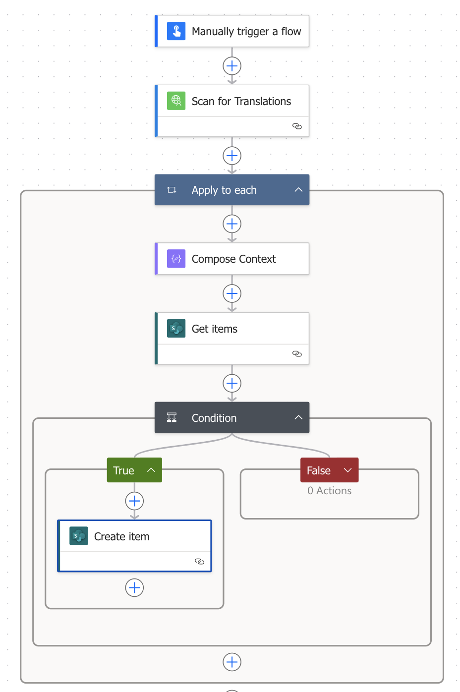

# Scan for Translations Flow

This describes setting up a flow in Power Automate to help scan your app for strings that need to be translated.  It's meant to be a help for developers.  The Translation Component allows develoeprs to create their apps with proper strings as placeholders for later translation.  This Flow helps get those placeholders into a Translations table ready to be passed on to a translator for proper translation.

The flow is very simple.  It accepts two inputs:

* `Code` which is a string such as might be copied from `</> View Code` of a component or screen within the Power Apps editor
* `Component` which is the name you've given to the instance of the Translation Component within your app.

It passes these inputs to the `Scan for Translations` Custom Connector ( see the README in the `connector` folder of this repo ), which does the regular expression matching to find strings.  The output of that connector is an array of objects with a property of `string`, and possibly a property of `context`.  The flow goes through each object in the output and looks for a record in the Translations list ( in SharePoint ) with the `Title` column matching the `string` property and the `Context` column matching the `context` property ( or "default" if no `context` exists ).  If it doesn't find, it creates one.

At the end of it, you should have a flow that looks like this:

## Manually Trigger a Flow

The trigger for the flow is a `Manually Trigger a Flow` trigger.  There should be two inputs:

* `Code` - a Text input with description `Output of </> View Code for the screen`
* `Component` - a Text input with description `Name of the Translation Component to scan for`

## Scan for Translations

The first step in the flow is a call to the custom connector `Scan for Translations` action.  This needs to be created first.  See the README in the `connector` folder of this repo.  This accepts two inputs:

* `Body/code` should be the Code input passed to the trigger
* `Body/component` should be the Component input passed to the trigger

## Apply to Each

The next step in the flow is to loop through all of the matches found by the connector with an `Apply to Each` action.  The input to the `Apply to Each` step is:

* The `Body` of the `Scan for Translations` step

### Compose Context

Here we set the default context of "default" if there is no context given for the translation ( as will most often be the case ).  Use the `Compose` action.  Name this action "Compose Context" and have the input be the following ( look first for a context in the item, and fallback to "default" ):

* `coalesce(item()?['context'],'default')`

### Get Items

Now you want to look up to see if there is an existing record in the Translation table for this string.  In this example we're connecting to a SharePoint list called "Translations", but the idea could be extended to table in Dataverse or an Excel file.  The inputs to the SharePoint `Get Items` action would be:

* `Site Address` - choose your SharePoint site
* `List Name` - choose your Translations table
* `Filter Query` ( under `Advanced parameters` ) set to the query to find the record:
  * `Title eq 'EscapedTitle' and Context eq 'EscapedContext'` where:
    * `EscapedTitle` is this formula: `replace(item()['string'],'''','''''')`
    * `EscapedContext` is this formula: `replace(outputs('Compose_Context'),'''','''''')`

The escaped formulas allow for strings or contexts that contain single quotes.  They look a little complicated, but they're really just replacing single quotes with two single quotes ( which is how Power Apps escapes single quotes ).

### Condition

Now we need to check if there is nothing existing yet.  Add a `Condition` action to see if:

* Formula: `empty(outputs('Get_items')?['body/value'])`
* Operator: `is equal to`
* Formula: `true`

That would indicate no record yet exists, so we'll create one.

#### Create Item

In the `True` branch of the condition action, add a `Create Item` action:

* `Site Address` - choose your SharePoint site
* `List Name` - choose your Translations table
* `Title` ( under advanced parameters ) - set to the formula `item()['string']`
* `Context` ( under advanced parameters ) - set to the output of the `Compose Context` action - `outputs('Compose_Context')`

